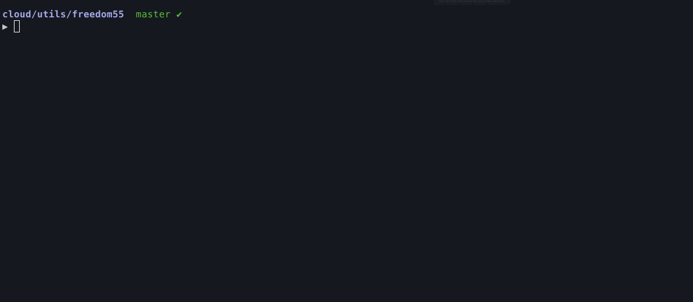

____

Freedom 55 CLI - The operational client for maintaining, modifying, and operating your homelab.
Written in Python by David Pinhas, this multi-tool is constantly expanding to support more integrations. Make your homelab management a ***breeze*** with Freedom 55 CLI.

The goal of this project is to give you the freedom to work efficiently and effectively with one unified tool.



## Menu

-   [Requirements](#Requirements)
-   [Installation](#Installation)
    -   [Installing Pip Binary](#Installing-Pip-Binary)
    -   [Windows Install](#Windows-Install)
-   [Usage](#Usage)
    -   [Options](#Options)
    -   [Configuration](#Configuration)
-   [Integrations](#Integrations)
    -   [ArgoCD](#ArgoCD)
    -   [OCI](#OCI)
    -   [SOPS](#SOPS)
    -   [Terraform](#Terraform)
    -   [Cloudflare](#Cloudflare)
-   [Contribution](#Contribution)
-   [License](#License)

## Requirements
- Python 3.10 or higher - Ensure `Python3.10`, `Pip3` and `Virtualenv` are installed
- Install Python dependencies `$ pip3 install -r requirements.txt`
- OCI keys and OCIDs - In order to [configure Freedom 55](#configuration) the OCI integration, you will need the [minimum required keys and OCIDs](https://docs.oracle.com/en-us/iaas/Content/API/Concepts/apisigningkey.htm#Required_Keys_and_OCIDs)

## Installation
In order to install the CLI on your local machine, you can clone the repository and utilize the startup.sh script:
```bash
git clone https://github.com/davidpinhas/freedom55.git
cd freedom55
source startup.sh
```

The script will create a virtual environment and provide steps to configure the alias for sourcing the venv.

#### Installing Pip Binary
To install the Freedom 55 CLI as a binary, you'll need to build the binary and install it using Pip3:
```bash
python3 -m build
pip3 install dist/fd55-$VERSION.tar.gz
```

Installing Freedom 55 as a binary is the recommended approach, as it provides improved performance when using the CLI, leading to faster execution times and a more efficient workflow.

#### Windows Install
To source the startup.sh file, you can use [Git Bash](https://git-scm.com/downloads), which can simplify the installation process.
Press the Windows Key > Search and press Git Bash > Follow the steps mentioned [above](#Installation).

For more details, read more on [What is Git Bash](https://www.gitkraken.com/blog/what-is-git-bash).

On Windows systems, the command "`fd55 config`" might result with the following error:
```bash
prompt_toolkit.output.win32.NoConsoleScreenBufferError: Found xterm, while expecting a Windows console. Maybe try to run this program using "winpty" or run it in cmd.exe instead. Or otherwise, in case of Cygwin, use the Python executable that is compiled for Cygwin.
```

To fix this issue, you'll need to use the **winpty** command to run the `fd55 config` command on Windows systems. This is because winpty is a compatibility layer that allows you to run console programs that are not natively supported on Windows.

By using winpty, you can run the `fd55 config` command without encountering any errors. Simply run the following command in your terminal:
```bash
winpty fd55 config
```

## Usage
To use the Freedom 55 CLI, we'll first call fd55, than the integration and it's sub-command:
```bash
$ fd55 [INTEGRATION] [COMMAND] [OPTIONS]
```

For example:
```bash
$ fd55 oci encrypt --string "Random text"
```

### Options
- `--log debug`: (Optional) Specify the log level. If not provided, the default level is 'info'.
- `--help`: (Optional) Show the help message and exit.

### Configuration
To configure Freedom 55 CLI with your desired integrations, run the `fd55 config` command:
```bash
$ fd55 config
2022-12-31 15:20:25,055|INFO|Running config validation
? Select integrations to configure
  ◉ OCI
  ◉ SOPS
  ○ ARGOCD
❯ ○ TERRAFORM
```

The `config` command will guide you through the configuration process and request the required parameters for the selected integrations.

## Integrations
Freedom 55 is a powerful multi-tool that simplifies your workflow by integrating a variety of tools into a single interface. With Freedom 55, you can use a single tool instead of juggling multiple CLIs, which can clutter your environment and can be pretty overwhelming.

Here's a list of currently supported tools (limited support):
* [ArgoCD](#Argocd)
* [OCI](#OCI)
* [SOPS](#SOPS)
* [Terraform](#Terraform)
* [Cloudflare](#Cloudflare)

### ArgoCD
---
The [ArgoCD](https://argo-cd.readthedocs.io/en/stable/) integration allows you to retrieve application information and manage the ArgoCD server and its applications.

This integration requires the following keys:
* `url` - ArgoCD endpoint, for example: https://argo.mydomain.com
* `api_token` - The API token with the required permission for managing applications. For generating a token [ArgoCD Docs](https://argo-cd.readthedocs.io/en/latest/user-guide/commands/argocd_account_generate-token/).

To modify an ArgoCD application, you will need to provide a [JSON](https://www.json.org/json-en.html) file with the desired application specifications.
Here's an example of a simple JSON file application spec:
```json
{
  "kind": "Application",
  "metadata": {
    "name": "my_app1",
    "namespace": "argocd"
  },
  "spec": {
    "destination": {
      "namespace": "my_app1",
      "server": "https://kubernetes.default.svc"
    },
    "project": "default",
    "source": {
      "path": "my_app1-chart",
      "repoURL": "https://github.com/$USER/my_app1.git",
      "targetRevision": "HEAD"
    },
    "syncPolicy": {
      "automated": {
        "prune": true,
        "selfHeal": true
      },
      "syncOptions": [
        "CreateNamespace=true"
      ]
    }
  }
}
```

For full details on the JSON payload, you can refer to the ArgoCD API Swagger documentation in the ArgoCD web interface. To access it, navigate to your ArgoCD server in your web browser:
https://argo.mydomain.com/swagger-ui.

#### Get Applications
Get all ArgoCD applications:
```bash
$ fd55 argo get-apps
```

Expected output:
```
2022-12-29 04:21:49,356|INFO|Getting ArgoCD applications

ArgoCD applications:
* my_app1
* my_app2
```

#### Create Application
Swagger ref - https://argo.mydomain.com/swagger-ui#operation/ApplicationService_Create

To create an application, use the `-f` option to provide the json file application spec:
```bash
$ fd55 argo create-app -f create-app.json
```

Expected output:
```
2022-12-29 04:19:36,131|INFO|Successfully created application my_app
```

#### Update Application
Swagger ref - https://argo.mydomain.com/swagger-ui#operation/ApplicationService_Update

To update an application:
```bash
$ fd55 argo update-app -f create-app.json
```

Expected output:
```
2022-12-29 04:44:05,954|INFO|Successfully updated application my_app
```

#### Delete Application
To delete an application, use the `-n` option to provide the name of the application you wish to delete:
```bash
$ fd55 argo delete-app -n my_app
```

Expected output:
```
2022-12-29 04:44:28,556|INFO|Successfully deleted application
```

### OCI
---
[OCI (Oracle Cloud Infrastructure)](https://www.oracle.com/il-en/cloud/) integration utilizes the [KMS feature](https://www.oracle.com/il-en/security/cloud-security/key-management/) and lets you encrypt and decrypt a string.

This integration requires the following keys:
* `user`
* `fingerprint`
* `tenancy`
* `region`
* `key_file`

For more details on retrieving the required keys, read more in Oracle's [minimum required keys and OCIDs](https://docs.oracle.com/en-us/iaas/Content/API/Concepts/apisigningkey.htm#Required_Keys_and_OCIDs) Docs.
#TODO: Add support for encryption and decryption of binaries.

#### List vaults
To get a list of all current vaults under the tenancy that was set in the [Freedom 55 config file](#Configuration), run the following command:
```bash
$ fd55 oci list-vaults
```

The resulting output should be a table that lists all vaults:
```
2023-01-04 03:10:53,303|INFO|Retrieving vaults data
+----------------------+---------+----------------------------------+
|         Name         |  State  |           Time Created           |
+----------------------+---------+----------------------------------+
|      test-vault      | DELETED | 2022-10-31T18:14:22.516000+00:00 |
|      main-vault      |  ACTIVE | 2022-10-17T17:08:29.486000+00:00 |
+----------------------+---------+----------------------------------+
```

To print the ID of the vaults, you can add the `--id` argument:
```bash
$ fd55 oci list-vaults --id
```

#### Create vault
To create a new vault, use the command below and provide the `-n`/`--name` argument to name the vault:
```bash
$ fd55 oci create-vault -n test-vault
```
The vault will be created as "*DEFAULT*" vault type.

#### Delete vault
To schedule a vault deletion, you can use the following command:
```bash
$ fd55 oci delete-vault --id $VAULT_ID
```

The default time for deletion is set to **30** days from the time this command was triggered.

To overwrite the days for deletion, you can use the `-d`/`--days` argument (the minimum value can be 7 days):
```bash
fd55 oci delete-vault --id $VAULT_ID -d 7
```

#### Encrypt String
To encrypt a secret:
```bash
$ fd55 oci encrypt -s "This is my secret"
```

Expected output:
```
2022-12-29 04:55:43,132|INFO|Encrypting string with KMS
2022-12-29 04:55:43,309|INFO|Encrypted string value - Qf7eN7k3cJBlAFpAtSVaPqM....
(KMS encrypted secret)
```

#### Decrypt With KMS
For decrypting a secret, the KMS encrypted value needs to be provided as a string (decrpyting needs to be performed with the same key the value was encrypted to begin with):
```bash
$ fd55 oci decrypt -s "Qf7eN7k3cJBlAFpAtSVaPqM...."
```

Expected output:
```
2022-12-29 04:56:08,020|INFO|Decrypting string with KMS
2022-12-29 04:56:08,184|INFO|Decrypted string - This is my secret
```

### SOPS
---
The SOPS integration encrypts and decrypts files using [Age encryption](https://github.com/FiloSottile/age).
Both encrypt and decrypt operations require an `-i`/`--input_file` and `-o`/`--output_file` file arguments.
**Limitation**: As the [SOPS SDK](https://github.com/mozilla/sops#12development-branch) only has support for Golang, the SOPS client is required to be installed, you can read more in the [Requirements section](#requirements).

This integration requires the following key:
* `key_path` - The path to the Age key.

To generate a secure key with Age for use with the SOPS integration, you can run the following command:
```bash
mkdir ~/.sops
age-keygen -o ~/.sops/key.txt
```

The `key_path` parameter requires the full path of the key file location, for example `/Users/$USER/.sops/key.txt`.

#### Encrypt File
Encrypt a file using SOPS with the following command, by providing the `-i`/`--input_file` and `-o`/`--output_file` files:
```bash
fd55 sops encrypt -i values.yaml -o encrypted-values.yaml
```

Expected output:
```
2022-12-29 05:13:38,099|INFO|Encrypting file with SOPS
2022-12-29 05:13:38,113|INFO|Finished encrypting encrypted-values.yaml file
```

#### Encrypt Using Regex
For encrypting specific values, you may use the ``--encrypted_regex`` or ``-r`` flags to set a regex condition to encrypt:
```bash
fd55 sops encrypt -i values.yaml -o encrypted-values.yaml -r "ingress$"
```

Expected output:
```
2022-12-29 05:15:42,549|INFO|Encrypting file with SOPS
2022-12-29 05:15:42,549|INFO|Using regex: ingress$
2022-12-29 05:15:42,564|INFO|Finished encrypting encrypted-values.yaml file
```

#### Encrypt Multiple Values With Regex
To encrypt multiple values, use the ``|`` sign:
```bash
fd55 sops encrypt -i values.yaml -o encrypted-values.yaml -r "ingress|domain|spec"
```

Expected output:
```
2022-12-29 05:52:53,955|INFO|Encrypting file with SOPS
2022-12-29 05:52:53,955|INFO|Using regex: ingress|domain|spec
2022-12-29 05:52:54,012|INFO|Finished encrypting encrypted-values.yaml file
```

#### Decrypt File
In order to decrypt a file, use the following:
```bash
fd55 sops decrypt -i encrypted-values.yaml -o decrypted-values.yaml
```

Expected output:
```
2022-12-29 05:10:09,797|INFO|Decrypting file with SOPS
2022-12-29 05:10:09,858|INFO|Finished decrypting decrypted-values.yaml file
```

### Terraform
---
To run the [Terraform](https://www.terraform.io) integration, you will need to provide the path of Terraform project with ``--path`` or ``-p`` flags.

#### Get Output From Terraform Plan
For example, run the command below to get the output of the Terraform plan:
```bash
fd55 tf output -p /path/to/tf/plan
```

#### Initialize Terraform Plan
```bash
fd55 tf init -p /path/to/tf/plan
```

#### Plan The Terraform Plan
```bash
fd55 tf plan -p /path/to/tf/plan
```

#### Apply Terraform Plan
```bash
fd55 tf apply -p /path/to/tf/plan
```

#### Destroy Terraform Plan
```bash
fd55 tf destroy -p /path/to/tf/plan
```

### Cloudflare
---
The [Cloudflare](https://www.cloudflare.com/en-gb/) integration utilizes the official [Cloudflare API](https://developers.cloudflare.com/api/) to perform its actions in the background to modify the configured domain DNS records.

This integration requires the following keys:
* `email` - Email address used to authenticate with Cloudflare.
* `api_key` - API key with Read permissions for DNS Zone.
* *`domain_name` - Domain name.

#### List DNS records
In order to list all DNS records, run the following command:
```bash
fd55 cf list-dns
```

Expected output:
```
2023-01-08 00:49:15,483|INFO|Retrieving DNS records for domain 'domain.com'
+----------------------------+-------+-------------------------+------+---------+
|            Name            |  Type |         Content         | TTL  | Proxied |
+----------------------------+-------+--------------------------+-----+---------+
|       domain.com           |   A   |     123.123.123.123     |  60  |  False  |
|    blog.domain.com         | CNAME |      domain.com         |  1   |   True  |
+----------------------------+-------+-------------------------+------+---------+
```

To list the IDs of the DNS records, use the `--id` flag.

#### DNS Records
Freedom 55 allows the user to modify domain DNS records by creating, updating and deleting records.

The **Create** and **Update** commands require the following arguments:
Option | Alias | Default| Description | Example | Required
--- | --- | --- | --- | --- | ---
`--name` | `-n` | NA | DNS name | *sub.domain.com* | **Yes**
`--content` | `-c` | NA | Target address content, can set IP or domain name | *127.0.0.1* | **Yes**
`--type` | `-t` | A | DNS record type | *CNAME* | **Yes**
`--ttl` | NA | 60 | Time to live | *300* | **No**
`--comment` | NA | "`DNS record updated with Freedom 55`" | Add comment to DNS record | "*New CNAME*" | **No**
`--proxied` | `-p` | `False` | Flag: Set proxy to TRUE | NA | **No**

##### Create DNS record
To create a DNS record, we can run the following command:
```bash
fd55 cf create-dns -n test.domain.com -c 123.123.123.123 -t A
```

The DNS will be created with the provided arguments and set default ones for the arguments that weren't provided, as we can see in the output:
```
2023-01-08 00:53:39,254|INFO|Creating DNS record 'test.domain.com'
2023-01-08 00:53:41,422|INFO|New metadata for 'test.domain.com' record:
2023-01-08 00:53:41,422|INFO| * id: $ID
2023-01-08 00:53:41,422|INFO| * zone_id: $ZONE_ID
2023-01-08 00:53:41,422|INFO| * zone_name: domain.com
2023-01-08 00:53:41,423|INFO| * name: test.domain.com
2023-01-08 00:53:41,423|INFO| * type: A
2023-01-08 00:53:41,430|INFO| * content: 123.123.123.123
2023-01-08 00:53:41,431|INFO| * proxiable: True
2023-01-08 00:53:41,431|INFO| * proxied: False
2023-01-08 00:53:41,431|INFO| * ttl: 60
2023-01-08 00:53:41,431|INFO| * locked: False
2023-01-08 00:53:41,431|INFO| * meta: {'auto_added': False, 'managed_by_apps': False, 'managed_by_argo_tunnel': False, 'source': 'primary'}
2023-01-08 00:53:41,431|INFO| * comment: DNS record updated with Freedom 55
2023-01-08 00:53:41,431|INFO| * tags: []
2023-01-08 00:53:41,431|INFO| * created_on: 2023-01-07T22:53:41.319273Z
2023-01-08 00:53:41,431|INFO| * modified_on: 2023-01-07T22:53:41.319273Z
2023-01-08 00:53:41,431|INFO|Finished modifying DNS record
```

The output will be similar to the update command.

##### Update DNS record
In order to update the DNS record, use the following command:
```bash
fd55 cf update-dns -n test.domain.com -c @ -t CNAME -p
```

In the above output we used the `@` sign to set the root address (the domain name) and configured the DNS record to be a *CNAME*.

##### Delete DNS record
To delete a DNS record, you can use the below command and specify the full DNS name:
```bash
fd55 cf delete-dns -n test.domain.com
```

Expected output:
```
2023-01-08 01:28:54,257|INFO|Deleting DNS record 'test.domain.com'
2023-01-08 01:28:55,169|INFO|Retrieving DNS record ID for test.domain.com
2023-01-08 01:28:58,198|INFO|Finished deleting DNS record 'test.domain.com'
```

## Contribution
- Give a star. :star:
- Feel free to Fork and Clone. :beers:
- Check my [issues](https://github.com/davidpinhas/freedom55/issues) or create a [new issue](https://github.com/davidpinhas/freedom55/issues/new) and give me a PR with your bugfix or improvement after. I appreciate any help! ❤️
- Big thanks to the devs and contributors mentioned in the [CREDITS](/CREDITS.md) list.

## License
This project is licensed under the MIT License. See [LICENSE](/LICENSE.md) for more details.

