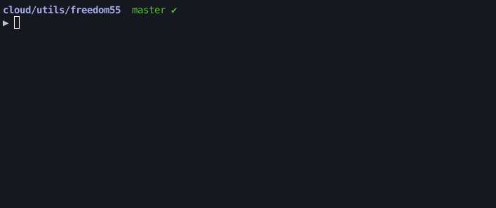

____

Freedom 55 CLI - the operational client for maintaining, modifying, and operating your homelab.
Written in Python by David Pinhas, this multi-tool is constantly expanding to support more integrations. Make your homelab management a ***breeze*** with Freedom 55 CLI.



## Requirements
- Python 3.10 or higher
- Click - can be installed using `$ pip install click`
- OCI - can be installed using `$ pip install oci oci-cli`
- OCI keys and OCIDs - In order to [configure Freedom 55](#configuration) the OCI integration, you will need the [minimum required keys and OCIDs](https://docs.oracle.com/en-us/iaas/Content/API/Concepts/apisigningkey.htm#Required_Keys_and_OCIDs)
- [OCI KMS Vault](https://www.oracle.com/il-en/security/cloud-security/key-management/) pre-configured
- SOPS client  - can be installed using `$ pip install sops`

## Installation
In order to install the CLI on your local machine, you can clone the repository and utilize the startup.sh script:
```bash
git clone https://github.com/davidpinhas/fd55.git
cd fd55
source startup.sh
```

The script will create a virtual environment and provide steps to configure the alias for sourcing the venv.

## Usage
To use the Freedom 55 CLI, we'll first call fd55, than the integration and it's sub-command:
```bash
$ fd55 [INTEGRATION] [COMMAND] [OPTIONS]
```

For example:
```bash
$ fd55 oci encrypt --string "Random text"
```

### Options
- `--log debug`: (Optional) Specify the log level. If not provided, the default level is 'info'.
- `--help`: (Optional) Show the help message and exit.

### Configuration
For configuring the Freedom 55 CLI with your desired integrations, run the `fd55 config` command:
```bash
fd55 config
[?] Select integrations to configure?:
   [X] OCI
   [X] SOPS
   [ ] ARGOCD
 > [ ] TERRAFORM
```

The `config` command will guide you through the configuration process and request the required parameters for the selected integrations.

## Integrations
Freedom 55 lets you integrate a variaty of tools and utilize them through one multi-tool.
The vision is to provide you the freedom to work with one unified multi-tool insead of multiple CLIs, which cause a mess in your environment and your head.

Here's a list of currently supported tools (limited support):
* [ArgoCD](#Argocd)
* [OCI](#OCI)
* [SOPS](#SOPS)
* [Terraform](#Terraform)

### ArgoCD
---
The ArgoCD integration will allow you to retrieve application info, along with managing the ArgoCD server and its applications.

This integration requires the following keys:
* `url` - ArgoCD endpoint, for example: https://argo.mydomain.com
* `api_token` - The API token with the required permission for managing applications. For generating a token [ArgoCD Docs](https://argo-cd.readthedocs.io/en/latest/user-guide/commands/argocd_account_generate-token/).

To modify ArgoCD application, you will need to provide a [JSON](https://www.json.org/json-en.html) file with a spec of your application.

Here's an example of a simple JSON file application spec:
```json
{
  "kind": "Application",
  "metadata": {
    "name": "my_app1",
    "namespace": "argocd"
  },
  "spec": {
    "destination": {
      "namespace": "my_app1",
      "server": "https://kubernetes.default.svc"
    },
    "project": "default",
    "source": {
      "path": "my_app1-chart",
      "repoURL": "https://github.com/$USER/my_app1.git",
      "targetRevision": "HEAD"
    },
    "syncPolicy": {
      "automated": {
        "prune": true,
        "selfHeal": true
      },
      "syncOptions": [
        "CreateNamespace=true"
      ]
    }
  }
}
```

For full details on json payload you may utilize the ArgoCD API swagger imbeded in the ArgoCD web-ui, by navigating to your ArgoCD https://argo.mydomain.com/swagger-ui.

#### Get Applications
Get all ArgoCD applications:
```bash
$ fd55 argo get-apps
```

Expected output:
```
2022-12-29 04:21:49,356|INFO|Getting ArgoCD applications

ArgoCD applications:
* my_app1
* my_app2
```

#### Create Application
Swagger ref - https://argo.mydomain.com/swagger-ui#operation/ApplicationService_Create

To create an application, use the `-f` option to provide the json file application spec:
```bash
$ fd55 argo create-app -f create-app.json
```

Expected output:
```
2022-12-29 04:19:36,131|INFO|Successfully created application my_app
```

#### Update Application
Swagger ref - https://argo.mydomain.com/swagger-ui#operation/ApplicationService_Update

To update an application:
```bash
$ fd55 argo update-app -f create-app.json
```

Expected output:
```
2022-12-29 04:44:05,954|INFO|Successfully updated application my_app
```

#### Delete Application
To delete an application, use the `-n` option to provide the name of the application you wish to delete:
```bash
$ fd55 argo delete-app -n my_app
```

Expected output:
```
2022-12-29 04:44:28,556|INFO|Successfully deleted application
```

### OCI
---
[OCI (Oracle Cloud Infrastructure)](https://www.oracle.com/il-en/cloud/) integration utilizes the [KMS feature](https://www.oracle.com/il-en/security/cloud-security/key-management/) and lets you encrypt and decrypt a string.

This integration requires the following keys:
* `user`
* `fingerprint`
* `tenancy`
* `region`
* `key_file`

For more details on retrieving the required keys, read more in Oracle's [minimum required keys and OCIDs](https://docs.oracle.com/en-us/iaas/Content/API/Concepts/apisigningkey.htm#Required_Keys_and_OCIDs) Docs.

#### Encrypt String
To encrypt a secret:
```bash
$ fd55 oci encrypt -s "This is my secret"
```

Expected output:
```
2022-12-29 04:55:43,132|INFO|Encrypting string with KMS
2022-12-29 04:55:43,309|INFO|Encrypted string value - Qf7eN7k3cJBlAFpAtSVaPqM....
(KMS encrypted secret)
```

#### Decrypt With KMS
For decrypting a secret, the KMS encrypted value needs to be provided as a string (decrpyting needs to be performed with the same key the value was encrypted to begin with):
```bash
$ fd55 oci decrypt -s "Qf7eN7k3cJBlAFpAtSVaPqM...."
```

Expected output:
```
2022-12-29 04:56:08,020|INFO|Decrypting string with KMS
2022-12-29 04:56:08,184|INFO|Decrypted string - This is my secret
```

#TODO: Add support for encryption and decryption of binaries.

### SOPS
---
The SOPS integration encrypts and decrypts files using [Age encryption](https://github.com/FiloSottile/age).
Both encrypt and decrypt operations require an `-i`/`--input_file` and `-o`/`--output_file` file arguments.
**Limitation**: As the [SOPS SDK](https://github.com/mozilla/sops#12development-branch) only has support for Golang, the SOPS client is required to be installed, you can read more in the [Requirements section](#requirements).

This integration requires the following key:
* `key_path` - The path to the Age key.

To generate a secure key with Age for use with the SOPS integration, you can run the following command:
```bash
mkdir ~/.sops
age-keygen -o ~/.sops/key.txt
```

The `key_path` parameter requires the full path of the key file location, for example `/Users/$USER/.sops/key.txt`.

#### Encrypt File
Encrypt a file using SOPS with the following command, by providing the `-i`/`--input_file` and `-o`/`--output_file` files:
```bash
fd55 sops encrypt -i values.yaml -o encrypted-values.yaml
```

Expected output:
```
2022-12-29 05:13:38,099|INFO|Encrypting file with SOPS
2022-12-29 05:13:38,113|INFO|Finished encrypting encrypted-values.yaml file
```

#### Encrypt Using Regex
For encrypting specific values, you may use the ``--encrypted_regex`` or ``-r`` flags to set a regex condition to encrypt:
```bash
fd55 sops encrypt -i values.yaml -o encrypted-values.yaml -r "ingress$"
```

Expected output:
```
2022-12-29 05:15:42,549|INFO|Encrypting file with SOPS
2022-12-29 05:15:42,549|INFO|Using regex: ingress$
2022-12-29 05:15:42,564|INFO|Finished encrypting encrypted-values.yaml file
```

#### Encrypt Multiple Values With Regex
To encrypt multiple values, use the ``|`` sign:
```bash
fd55 sops encrypt -i test.yaml -o test.yaml2 -r "ingress|domain|spec"
```

Expected output:
```
2022-12-29 05:52:53,955|INFO|Encrypting file with SOPS
2022-12-29 05:52:53,955|INFO|Using regex: ingress|domain|spec
2022-12-29 05:52:54,012|INFO|Finished encrypting encrypted-values.yaml file
```

#### Decrypt File
In order to decrypt a file, use the following:
```bash
fd55 sops decrypt -i encrypted-values.yaml -o decrypted-values.yaml
```

Expected output:
```
2022-12-29 05:10:09,797|INFO|Decrypting file with SOPS
2022-12-29 05:10:09,858|INFO|Finished decrypting decrypted-values.yaml file
```

### Terraform
---
To run the [Terraform](https://www.terraform.io) integration, you will need to provide the path of Terraform project with ``--path`` or ``-p`` flags.

#### Get Output From Terraform Plan
For example, run the command below to get the output of the Terraform plan:
```bash
fd55 tf output -p /Users/davidpinhas/workspace/cloud/k3s-oci-cluster/example
```

#### Initialize Terraform Plan
```bash
fd55 tf init -p /Users/davidpinhas/workspace/cloud/k3s-oci-cluster/example
```

#### Plan The Terraform Plan
```bash
fd55 tf plan -p /Users/davidpinhas/workspace/cloud/k3s-oci-cluster/example
```

#### Apply Terraform Plan
```bash
fd55 tf apply -p /Users/davidpinhas/workspace/cloud/k3s-oci-cluster/example
```

#### Destroy Terraform Plan
```bash
fd55 tf destroy -p /Users/davidpinhas/workspace/cloud/k3s-oci-cluster/example
```

## Contribution
- Give a star :star:
- Feel free to Fork and Clone :beers:
- Check my [issues](https://github.com/davidpinhas/cryptoview/issues) or create a [new issue](https://github.com/davidpinhas/cryptoview/issues/new) and give me a PR with your bugfix or improvement after. I appreciate any help! ❤️

## License
This project is licensed under the MIT License. See [LICENSE](/LICENSE.md) for more details.
